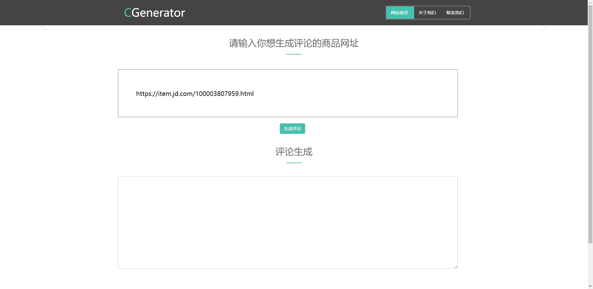
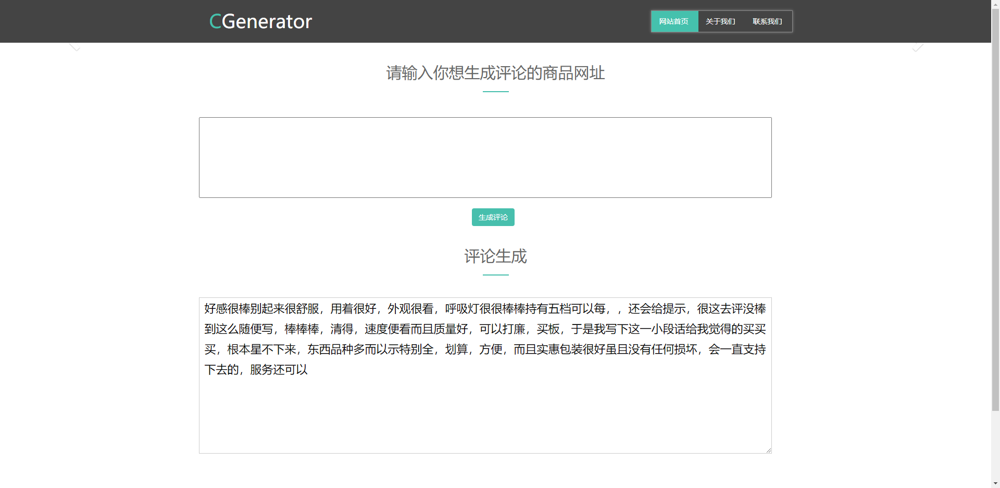

# CGenerator
Product Comments Automatic Generation

商品评论自动生成

This repo is our final project of course Natural Language Processing in Xi'an Jiaotong University. Our goal is to generate different product comments according to the given product categories. The model usd in our project is based on [Encoder-Agnostic Adaptation for Conditional Language Generation](https://arxiv.org/abs/1908.06938), Zachary M. Ziegler, Luke Melas-Kyriazi, Sebastian Gehrmann and Alexander M. Rush. The code in this repo is also based on their [code](https://github.com/harvardnlp/encoder-agnostic-adaptation).

## Table of Contents

- [Abstract](#abstract)
- [Dependencies](#dependencies)
- [GPT-2 Pretrained Weights](#GPT-2-pretrained-weights)
- [Data](#data)
- [Train](#train)
- [Demo](#demo)

## Abstract

With e-commerce entering thousands of families and gradually getting matured, online shopping platforms such as Taobao and JD have played an important role in our lives. From our online shopping experience, it is common for customers to give comments on goods in exchange for cash. However, many people give up such opportunities because they do not want to come up with comments. Based on this phenomenon, we choose the automatic generation of product comments as the direction of out project, striving to generate product comments quickly of multiple categories in order to solve the problem of the customers. 

The GPT-2 model is constructed using the decoder module of the transformer. It is prominent in text generation. The model used in this project is mainly based on GPT-2. It encodes different product categories and integrates the results obtained from the encoding network into the GPT-2 network in the self-attention mechanism, so that generated comments on different types of commodities have different focuses and the automatic generation of comments on multiple commodity types can be more accurate. We obtained the customers’ comments data of various categories of products from JD, and preprocessed the data to obtain customers’ comment data with category labels for model training. Finally, the Flask framework was used to implement building the system, and completed the function which is that if you input the product URL, the comment on the corresponding category of the product can be automatically generated and output the result on the interactive interface.

## Dependencies

This code was tested with `Python3.6` and `Pytorch 1.0.1`. See `requirements.txt` for a complete list of dependencies.

## GPT-2 Pretrained Weights

As our comments data are all in Chinese, we use the GPT-2 pretrained weights provided in [GPT2-Chinese](https://github.com/Morizeyao/GPT2-Chinese). 

## Data

We collected our comments data in JD. We provide our raw data in [百度网盘【053t】](https://pan.baidu.com/s/1ty3TZOAZ-uAZJ4Z23Fj9lA). There are two files that one contains about 500,000 comments and one contains about 300,000 comments. In our project only the comments and the categories are required. Thus, you may need filter the raw data before training and reserve the comments from the selected categories.

After filtering the raw data, put them in `./data/comments/` as `.bpe` files. For example, save the commments in `./data/comments/<train/valid>.tgt.bpe` and their corresponding categories in `./data/comments/<train/test>.src.bpe`. Each line contains one comment and its category. Then, run the following command to generate binary data for training.

`python preprocess.py -train_src data/comments/train.src.bpe -train_tgt data/comments/train.tgt.bpe -valid_src data/comments/valid.src.bpe -valid_tgt data/comments/valid.tgt.bpe -save_data data/comments/COMMENTS_BPETGT -tgt_seq_length_trunc 200 -tgt_vocab <the path to GPT2-Chinese pretrained weights>/vocab.txt -fixed_vocab -free_src`

## Train

We try the following three methods to generate comments. Run the commands to train the models with different methods. 

**Simple fusion**: `python train.py -config config/comments/transformer_comments_cond_ch.yml -run_name simple_fusion -gpt2_params_path <path to GPT2-Chinese pretrained weights>/<GPT-2 weights>.bin -simple_fusion -dropout 0.1 -accum_count 30

**Context attention**: `python train.py -config config/comments/transformer_comments_ctxattn_ch.yml -run_name ctxattn -gpt2_params_path <path to GPT2-Chinese pretrained weights>/<GPT-2 weights>.bin -gpt2_init_embanddec`

**Pseudo self attention**: `python train.py -config config/comments/transformer_comments_psa_ch.yml -run_name psa -gpt2_params_path <path to GPT2-Chinese pretrained weights>/<GPT-2 weights>.bin -gpt2_init_embanddec`

In our experiments, we find the model with Pseudo self attention can generate comments that are most similar to what human beings would write. 

## Demo

To show the demo, at first run the following command.

`python demo.py -max_length 200 -model <path/to/model.pt> -random_sampling_temp 0.5`

Then you can open `http://127.0.0.1:5500/index/html` in your local browser and the website is demonstrated.

Fill in the url of the product which you want to generate comment for and click the button. In a few seconds, you would get the generated comment. 

